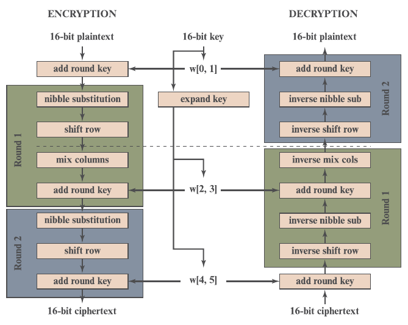
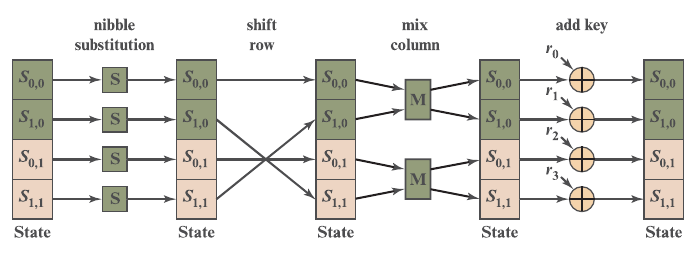
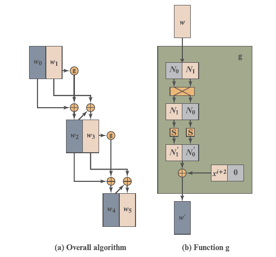

# S-AES

## Autor

**Camilo Andrés Sandoval Delgado**

**cod: 20202678031**

* Estudiante de la Universidad Distrital Francisco José de Caldas
* Facutlad Tecnológica
* Ingeniería Telemática
* Proyecto final para la materia de **Criptología**

## Resumen

A continuación se observará el desarrollo e implementación del algoritmo S-AES para encriptar y desencriptar texto. Además se realizará un ataque de fuerza bruta y se observarán los resultados.

## Introducción

**Algoritmo S-AES:** (Simplified AES)

Se trata de un algoritmo cifrador de texto por bloques.

El algoritmo de cifrado toma un bloque de texto sin formato de 16 bits como entrada y una clave de 16 bits y produce un bloque de texto cifrado de 16 bits como salida.

```
clave_16_bits = -U
texto_a_encriptar = do

valor_encriptado = encriptar(texto_a_encriptar,clave_16_bits)
valor_encriptado = '¤
```

El algoritmo de descifrado S-AES toma un bloque de texto cifrado de 16 bits y la misma clave de 16 bits utilizada para producir ese texto cifrado como entrada y produce el bloque original de texto sin formato de 16 bits como salida.

```
clave_16_bits = -U
texto_a_desencriptar = '¤

valor_desencriptado = desencriptar(texto_a_desencriptar,clave_16_bits)
valor_desencriptado = do
```

---

### Funcionamiento general

El algoritmo de cifrado implica el uso de cuatro funciones o transformaciones diferentes:

* añadir clave (Ak),
* sustitución de nibble (NS),
* desplazamiento de fila (SR)
* mezcla de columna (MC)


Podemos expresar de forma concisa el algoritmo de cifrado como una composición de funciones: 

\begin{align}
A_{k_2}°SR°NS°A_{k_1}°MC°SR°NS°A_{k_0}
\end{align}

de modo que $A_{k_0}$ se aplica primero.

Para realizar la encripción de los datos se realizan 3 rondas, la ronda 0 está compuesta por AK, la ronda 1 está compuesta por NS, SR, MC, AK, la ronda 2 está compuesta por NS, SR, AK. Cada una de las rondas usa una llave diferente generadas de la llave original, el flujo completo se muestra a continuación.



### Ronda completa

Una ronda completa de encripción, que contiene los 4 métodos, se ve gráficamente de la siguiente manera:



### Expansión de llaves


Finalmente la expansión de llaves se obtienen con las siguientes ecuaciones:

$$
w_0 = First8Bits(key)
$$

$$
w_1 = Seconds8Bits(key)
$$

$$
w_2 = w_0 \oplus g(w_1) = w_0 \oplus RCON(1) \oplus SubNib(RotNib(w_1))
$$

$$
w_3 = w_2 \oplus w_1
$$

$$
w_4 = w_2 \oplus g(w_3) = w_2 \oplus RCON(2) \oplus SubNib(RotNib(w_3))
$$

$$
w_5 = w_4 \oplus w_3
$$

Se evidencia todo el flujo en la siguiente imagen:



Para conocer más a detalle el funcionmiento del algoritmo, por favor diríjase a las [referencias](references.md)
