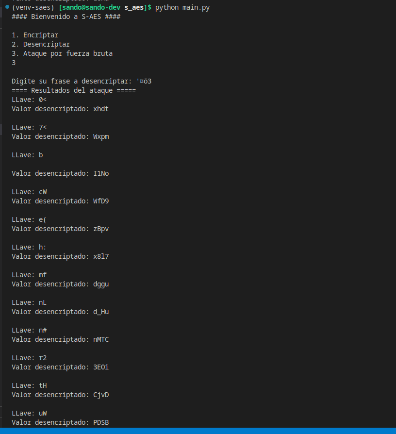

# Resultados


## Resultados obtenidos

### Encriptando y Desencriptando

Para poner a prueba el encriptador y desencriptador:

    Se cifra inicialmente la palabra: dona

    Con la llave: -U

    Esta genera el texto cifrado: '¤õ3

luego ese valor se pasa al desencriptador con la misma llave
el resultado es que el valor desencriptado es el mismo que el inicial

    Se descifra la palabra: '¤õ3

    Con la llave: -U

    Esta genera el texto descifrado: dona

```python
from s_aes.logic.encrypt import encrypt_saes
from s_aes.logic.decrypt import decrypt_saes
from s_aes.logic.key_logic import generate_keys

keys = generate_keys("-U")
out = encrypt_saes("dona",keys)
out2 = decrypt_saes("'¤õ3",keys)
print(out2) # dona
```


### Ataque por fuerza bruta

Este ataque se realiza basado en la metodología ya presentada.

Se ejecuta el ataque desde la consola

```sh
(venv-saes) [sando@sando-dev s_aes]$ python main.py 
#### Bienvenido a S-AES ####

1. Encriptar
2. Desencriptar
3. Ataque por fuerza bruta
3

Digite su frase a desencriptar: '¤õ3
```

La cantidad de llaves a usar es de 9900

por cada llave el programa desencripta el texto y lo guarda, con los valores generados hace internamente las validaciones del numeral **a** y **b** de los pasos de la metodología, finalmente muestra en pantalla los valores resultantes para que el usuario realice la validación del numeral **c**. 



El programa arrojo 42 de 9900 valores iniciales, esos 42 habrá que validarlos a mano y determinar si la respuesta es significativa, el resultado fue el siguiente:

```
==== Resultados del ataque =====
LLave: 0<
Valor desencriptado: xhdt

LLave: 7<
Valor desencriptado: Wxpm

LLave: b

Valor desencriptado: I1No

LLave: cW
Valor desencriptado: WfD9

LLave: e(
Valor desencriptado: zBpv

LLave: h:
Valor desencriptado: x8l7

LLave: mf
Valor desencriptado: dggu

LLave: nL
Valor desencriptado: d_Hu

LLave: n#
Valor desencriptado: nMTC

LLave: r2
Valor desencriptado: 3EOi

LLave: tH
Valor desencriptado: CjvD

LLave: uW
Valor desencriptado: PDSB

LLave: xh
Valor desencriptado: dBSa

LLave: yP
Valor desencriptado: g7RJ

LLave: z6
Valor desencriptado: MqOR

LLave: CL
Valor desencriptado: Gobl

LLave: DG
Valor desencriptado: flCG

LLave: Ey
Valor desencriptado: acyJ

LLave: IC
Valor desencriptado: 2MvG

LLave: L4
Valor desencriptado: sZwT

LLave: Nm
Valor desencriptado: nMiv

LLave: RA
Valor desencriptado: 1swe

LLave: W[
Valor desencriptado: oQgu

LLave: Yz
Valor desencriptado: GCJD

LLave: Ze
Valor desencriptado: aqbO

LLave: "C
Valor desencriptado: zxT7

LLave: $S
Valor desencriptado: 92qD

LLave: 'j
Valor desencriptado: M0G7

LLave: )_
Valor desencriptado: 9qqR

LLave: ,]
Valor desencriptado: Wp2A

LLave: -U
Valor desencriptado: dona

LLave: .9
Valor desencriptado: m9dH

LLave: /z
Valor desencriptado: IbLQ

LLave: ;T
Valor desencriptado: a0GA

LLave: =U
Valor desencriptado: sbt3

LLave: ?_
Valor desencriptado: 3s6J

LLave: \[
Valor desencriptado: mXTG

LLave: _8
Valor desencriptado: CONC

LLave: `H
Valor desencriptado: nOOT

LLave: |l
Valor desencriptado: wdpO

LLave: }9
Valor desencriptado: UlzR

LLave:  {
Valor desencriptado: y1kH
```

Revisando el Resultado nos damos cuenta que hay algunos valores que tienen sentido y que podrían haber sido el valor original como: `CONC`, `dona` y `nOOT`.
de estos el valor nOOT carece de algún respaldo y nos quedamos con `CONC` y `dona`

En nuestro caso hipotetico hemos capturado el texto cifrado de un perfil previamente analizado, un hombre con gustos por el dulce, de forma que la llave con más razón lógica es `dona`.

Haciendo el proceso inverso de cifrado nos damos cuenta que el valor original era `dona` con su llave `-U`, de manera que determinamos que hemos podido hallar la clave por fuerza bruta.

## Análisis de resultados

1. El proceso de encripción y desencripción del algoritmo desarrollado es funcional
2. No existe una correlación directa entre el texto original y el texto cifrado mas que la longitud de sus caracteres, no obstante este es un hecho del que nos hemos valido para ejercer el ataque de fuerza bruta.
3. Es posible hacer ataques de fuerza bruta y hallar las llaves de usuarios para textos cortos, cuando se ha logrado capturar el texto crifrado y se requiere encontrar la llave.
4. El perfil de los sujetos "víctima" es de gran utilidad, pues al saber como son se puede establecer como piensan y por ende como redactan sus claves.
5. S-AES es de facíl entendimiento y muy útil para fines educativos.
