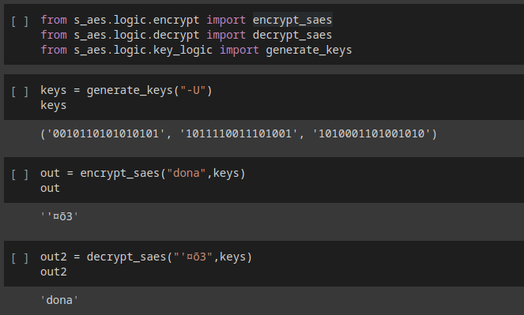

# Resultados


## Resultados obtenidos

### Encriptando y Desencriptando

Para poner a prueba el encriptador y desencriptador:

    Se cifra inicialmente la palabra: dona

    Con la llave: -U

    Esta genera el texto cifrado: '¤õ3

luego ese valor se pasa al desencriptador con la misma llave
el resultado es que el valor desencriptado es el mismo que el inicial

    Se descifra la palabra: '¤õ3

    Con la llave: -U

    Esta genera el texto descifrado: dona

```python
from s_aes.logic.encrypt import encrypt_saes
from s_aes.logic.decrypt import decrypt_saes
from s_aes.logic.key_logic import generate_keys

keys = generate_keys("-U")
out = encrypt_saes("dona",keys)
out2 = decrypt_saes("'¤õ3",keys)
print(out2) # dona
```



### Ataque por fuerza bruta


## Análisis de resultados

Análisis de resultados: Donde realizan su análisis de lo obtenido
Conclusiones
